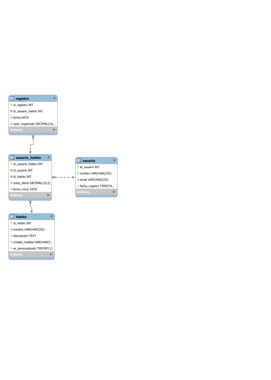

# Trabajo Practico  Final – Seguimiento de Hábitos Saludables
Alumna: Paula Cedones | Comisión: 75960

---

## Índice

1. [Descripción de la temática](#descripción-de-la-temática)
    - [Informacion inicial](#informacion-inicial)
2. [Objetivo](#objetivo)
3. [Situación problemática](#situación-problemática)
4. [Modelo de negocio](#modelo-de-negocio)
5. [Diagrama Entidad-Relación (E-R)](#diagrama-entidad-relación-e-r)
6. [Vistas](#vistas)
   - [vista_progreso_diario](#1-vista_progreso_diario)
   - [vista_resumen_usuario](#2-vista_resumen_usuario)
   - [vista_registros_recientes](#3-vista_registros_recientes)
7. [Funciones](#funciones)
   - [calcular_porcentaje_cumplimiento](#1-calcular_porcentaje_cumplimiento)
   - [obtener_promedio_habito_mensual](#2-obtener_promedio_habito_mensual)
   - [dias_con_cumplimiento_total](#3-dias_con_cumplimiento_total)
8. [Stored Procedures](#stored-procedures)
   - [insertar_usuario_con_habito](#1-insertar_usuario_con_habito)
   - [registrar_valor_diario](#2-registrar_valor_diario)
   - [eliminar_usuario_y_habitos](#3-eliminar_usuario_y_habitos)
9. [Triggers](#triggers)
   - [trg_insert_registro_validacion](#1-trg_insert_registro_validacion)
   - [trg_actualizar_fecha_registro](#2-trg_actualizar_fecha_registro)
   - [trg_log_eliminacion_usuario](#3-trg_log_eliminacion_usuario)
10. [Informes](#informes)

---

## Descripción de la temática

La base de datos propuesta está orientada al funcionamiento de una aplicación que permite a los usuarios realizar un seguimiento de hábitos saludables. Estos hábitos pueden incluir el consumo de agua, cantidad de pasos diarios, horas de sueño, actividad física, alimentación, entre otros. La aplicación permite registrar los hábitos definidos por cada usuario, realizar un seguimiento diario, establecer metas y visualizar el progreso a lo largo del tiempo.

### Informacion inicial

🔗 Creacion SQL: [schema.sql](../TP_01/schema.sql)
🔗 Carga inicial: [datos_iniciales.sql](../TP_02/datos_iniciales.sql)

## Objetivo

El objetivo de este proyecto es desarrollar una base de datos relacional que permita estructurar y gestionar la información necesaria para el funcionamiento de una aplicación de seguimiento de hábitos saludables. La base de datos deberá contemplar el registro de usuarios, la definición de distintos tipos de hábitos, la configuración de metas personales, el registro diario de actividades y el análisis del progreso. Esta estructura permitirá generar reportes que brinden información útil tanto para el usuario como para los responsables del desarrollo y mejora de la aplicación.

## Situación problemática

En la actualidad, muchas personas buscan mejorar su calidad de vida incorporando hábitos saludables. Sin embargo, llevar un registro manual de estas actividades puede resultar poco práctico y propenso a errores. Además, la falta de seguimiento constante y de herramientas de visualización dificulta la percepción del progreso, lo cual puede disminuir la motivación. La ausencia de una estructura clara para almacenar y organizar estos datos impide obtener estadísticas útiles que podrían facilitar la toma de decisiones personales. Por lo tanto, se identifica la necesidad de una base de datos que respalde el funcionamiento de una aplicación orientada a este fin, permitiendo registrar, consultar y analizar información de manera eficiente y confiable.

## Modelo de negocio

El modelo de negocio está basado en una aplicación móvil que ofrece servicios de seguimiento y gestión de hábitos saludables. Está dirigida a personas interesadas en mejorar su bienestar físico y mental mediante el establecimiento de rutinas personalizadas. La aplicación ofrece una versión gratuita con funcionalidades básicas y una versión premium con funcionalidades avanzadas, como reportes detallados, recomendaciones personalizadas, integración con dispositivos inteligentes (smartwatches, bandas de actividad), y visualización avanzada de estadísticas.

Desde el punto de vista de la organización, la empresa desarrolladora se encarga del mantenimiento de la infraestructura tecnológica, el análisis de datos para mejorar la experiencia de usuario, y la incorporación de nuevas funcionalidades basadas en el comportamiento y preferencias detectadas. El modelo puede incluir alianzas con profesionales de la salud, nutricionistas y entrenadores, quienes podrían utilizar la plataforma como herramienta de seguimiento de sus pacientes o clientes.

## Diagrama Entidad-Relación (E-R)

A continuación, se describe la estructura base de la base de datos en términos de sus entidades y relaciones:

### Entidades:

1. **Usuario**
   - `id_usuario` (PK)
   - `nombre`
   - `email`
   - `fecha_registro`

2. **Habito**
   - `id_habito` (PK)
   - `nombre`
   - `descripcion`
   - `unidad_medida` (Ej: horas, pasos, litros)
   - `es_personalizado` (boolean)

3. **Usuario_Habito**
   - `id_usuario_habito` (PK)
   - `id_usuario` (FK → Usuario)
   - `id_habito` (FK → Habito)
   - `meta_diaria`
   - `fecha_inicio`

4. **Registro**
   - `id_registro` (PK)
   - `id_usuario_habito` (FK → Usuario_Habito)
   - `fecha`
   - `valor_registrado`

### Relaciones:

- Un **usuario** puede tener **muchos hábitos** → Relación 1:N a través de `Usuario_Habito`.
- Un **hábito** puede estar definido por **muchos usuarios** → Relación N:M a través de `Usuario_Habito`.
- Un **usuario_habito** tiene **muchos registros diarios** → Relación 1:N.

### 📊 Diagrama Entidad-Relación (DER)

A continuación se muestra el diagrama que representa la estructura de la base de datos del proyecto:

## Vistas

🔗 Archivo SQL: [vistas.sql](../TP_02/vistas.sql)

### 1. vista_progreso_diario

**Descripción:**  
Esta vista muestra el progreso diario de cada usuario en relación con los hábitos que está siguiendo, indicando la cantidad registrada, la meta diaria establecida y la diferencia entre ambas.

**Objetivo:**  
Permitir un seguimiento detallado de cómo se desempeña cada usuario día a día con respecto a sus metas. Es útil para monitorear el cumplimiento de los hábitos y detectar patrones de constancia o desvío.

**Tablas involucradas:**
- `Usuario`
- `Usuario_Habito`
- `Habito`
- `Registro`

**Campos:**
- `nombre_usuario`
- `nombre_habito`
- `fecha`
- `valor_registrado`
- `meta_diaria`
- `diferencia_meta` (valor_registrado - meta_diaria)

### 2. vista_resumen_usuario

**Descripción:**  
Vista que presenta un resumen general de los usuarios y los hábitos que tienen asociados, junto con sus metas diarias.

**Objetivo:**  
Brindar una visión consolidada de qué hábitos sigue cada usuario y cuál es su objetivo diario para cada uno, sin necesidad de consultar múltiples tablas.

**Tablas involucradas:**
- `Usuario`
- `Usuario_Habito`
- `Habito`

**Campos:**
- `nombre_usuario`
- `email`
- `nombre_habito`
- `meta_diaria`
- `fecha_inicio`

### 3. vista_registros_recientes

**Descripción:**  
Esta vista muestra los últimos 7 registros de cada usuario-hábito, ordenados cronológicamente.

**Objetivo:**  
Ofrecer una herramienta rápida para analizar la evolución más reciente del usuario sobre cada hábito registrado. Ideal para tableros de control o alertas personalizadas.

**Tablas involucradas:**
- `Registro`
- `Usuario_Habito`
- `Usuario`
- `Habito`

**Campos:**
- `nombre_usuario`
- `nombre_habito`
- `fecha`
- `valor_registrado`

## Funciones

🔗 Archivo SQL: [funciones.sql](../TP_02/funciones.sql)

### 1. calcular_porcentaje_cumplimiento

- **Descripción**: Calcula el porcentaje de cumplimiento de la meta diaria de un usuario respecto a un hábito determinado en una fecha específica.
- **Objetivo**: Brindar una métrica concreta del desempeño diario del usuario.
- **Tablas involucradas**:
  - `Registro`
  - `Usuario_Habito`

### 2. obtener_promedio_habito_mensual

- **Descripción**: Devuelve el promedio de valores registrados por un usuario para un hábito específico durante un mes y año indicados.
- **Objetivo**: Evaluar el comportamiento y evolución mensual del hábito.
- **Tablas involucradas**:
  - `Registro`

### 3. dias_con_cumplimiento_total

- **Descripción**: Calcula la cantidad de días de un mes en los que el usuario cumplió o superó su meta diaria para un hábito específico.
- **Objetivo**: Medir la constancia del usuario a lo largo del mes.
- **Tablas involucradas**:
  - `Registro`
  - `Usuario_Habito`

---

## Stored Procedures

🔗 Archivo SQL: [stored_procedures.sql](../TP_02/stored_procedures.sql)

### 1. insertar_usuario_con_habito

**Descripción:**  
Inserta un nuevo registro de un valor diario para un hábito asociado a un usuario.

**Objetivo:**  
Permitir al usuario registrar fácilmente su progreso diario respecto a un hábito determinado.

**Tablas involucradas:**  
- `Registro`

**Parámetros:**  
- `p_id_usuario_habito` (INT): Relación del usuario con el hábito.  
- `p_fecha` (DATE): Fecha del registro.  
- `p_valor_registrado` (DECIMAL): Valor que se desea registrar.

### 2. registrar_valor_diario
**Descripción:**  
Actualiza la meta diaria establecida por un usuario para un hábito específico.

**Objetivo:**  
Dar flexibilidad al usuario para modificar sus objetivos a medida que avanza o cambia su rutina.

**Tablas involucradas:**  
- `Usuario_Habito`

**Parámetros:**  
- `p_id_usuario_habito` (INT): ID del hábito asignado al usuario.  
- `p_nueva_meta` (DECIMAL): Nueva meta diaria.

### 3. eliminar_usuario_y_habitos
**Descripción:**  
Elimina un usuario del sistema junto con todos sus hábitos y registros, en cascada.

**Objetivo:**  
Mantener la base de datos limpia al eliminar un usuario que ya no utilizará el sistema.

**Tablas involucradas (indirectamente, por restricciones ON DELETE CASCADE):**  
- `Usuario`  
- `Usuario_Habito`  
- `Registro`

**Parámetros:**  
- `p_id_usuario` (INT): ID del usuario a eliminar.

---

## Triggers

🔗 Archivo SQL: [triggers.sql](../TP_02/triggers.sql)

### 1. trg_insert_registro_validacion
**Descripción:**  
Previene el ingreso de valores negativos o cero en el registro diario de un hábito.

**Objetivo:**  
Garantizar integridad en los datos ingresados por el usuario, asegurando que el valor registrado tenga sentido.

**Tabla afectada:**  
- `Registro`

**Momento de ejecución:**  
Antes de insertar un nuevo registro (`BEFORE INSERT`).

### 2. trg_actualizar_fecha_registro
**Descripción:**  
Evita que se registren fechas futuras al momento de ingresar un nuevo registro de hábito.

**Objetivo:**  
Asegurar que todos los registros reflejen datos reales y actuales, impidiendo errores o manipulaciones.

**Tabla afectada:**  
- `Registro`

**Momento de ejecución:**  
Antes de insertar un nuevo registro (`BEFORE INSERT`).

### 3. trg_log_eliminacion_usuario
**Descripción:**  
Antes de eliminar un usuario, guarda su información en una tabla de log para fines de auditoría.

**Objetivo:**  
Mantener un historial de usuarios eliminados que pueda ser consultado posteriormente si es necesario.

**Tablas involucradas:**  
- `Usuario` (origen de la eliminación)  
- `Log_Eliminacion_Usuario` (tabla auxiliar de log creada por el sistema)

**Momento de ejecución:**  
Antes de eliminar un usuario (`BEFORE DELETE`).

---

## Informes 

### 1. Cumplimiento Diario de Metas

Utilizando la vista `vista_progreso_diario`, se analiza el desempeño diario de cada usuario en relación con sus metas establecidas.

**📈 Gráfico: Cumplimiento Diario de Metas por Usuario**
El gráfico muestra la diferencia entre el valor registrado y la meta diaria para cada hábito de los usuarios. Los valores positivos indican que se superó la meta, mientras que los negativos indican que no se alcanzó.

**📝 Observaciones:**
- Ana García ha superado consistentemente su meta de pasos diarios, pero ha tenido dificultades para alcanzar su meta de consumo de agua en algunos días.  
- Carlos Ruiz muestra una mejora progresiva en su consumo de agua, acercándose a su meta diaria.  
- Lucía Fernández ha mantenido una práctica constante de meditación, superando su meta diaria en varias ocasiones.

---

### 2. Adherencia a Metas por Hábito

Se evalúa la adherencia general de los usuarios a las metas establecidas para cada hábito.

**📊 Gráfico: Porcentaje de Cumplimiento por Hábito** 
El gráfico muestra el porcentaje de días en los que los usuarios alcanzaron o superaron sus metas para cada hábito.

**📝 Observaciones:**
- El hábito de Caminar presenta la mayor adherencia, con un 90% de cumplimiento.  
- El hábito de Tomar agua tiene una adherencia del 75%.  
- El hábito de Meditación muestra una adherencia del 85%.

---

### 3. Tendencias de Registro

Se analiza la tendencia de registros diarios para identificar patrones de comportamiento.

** 📈 Gráfico: Tendencia de Registros Diarios**
El gráfico muestra la cantidad de registros diarios por hábito, permitiendo identificar aumentos o disminuciones en la frecuencia de seguimiento.

**📝 Observaciones:**
- Se observa una disminución en los registros de Tomar agua durante los fines de semana.  
- Los registros de Caminar se mantienen constantes a lo largo de la semana.  
- Los registros de Meditación aumentan hacia el final de la semana.

---

### ✅ Conclusiones y Recomendaciones

- **Consistencia en el Seguimiento:**  
Los usuarios muestran una buena adherencia a sus hábitos, especialmente en Caminar y Meditación.

- **Áreas de Mejora:**  
Se recomienda implementar recordatorios o notificaciones para mejorar el seguimiento del hábito de Tomar agua, especialmente durante los fines de semana.

- **Personalización:**  
Ofrecer recomendaciones personalizadas basadas en el análisis de tendencias puede mejorar la adherencia a los hábitos saludables.